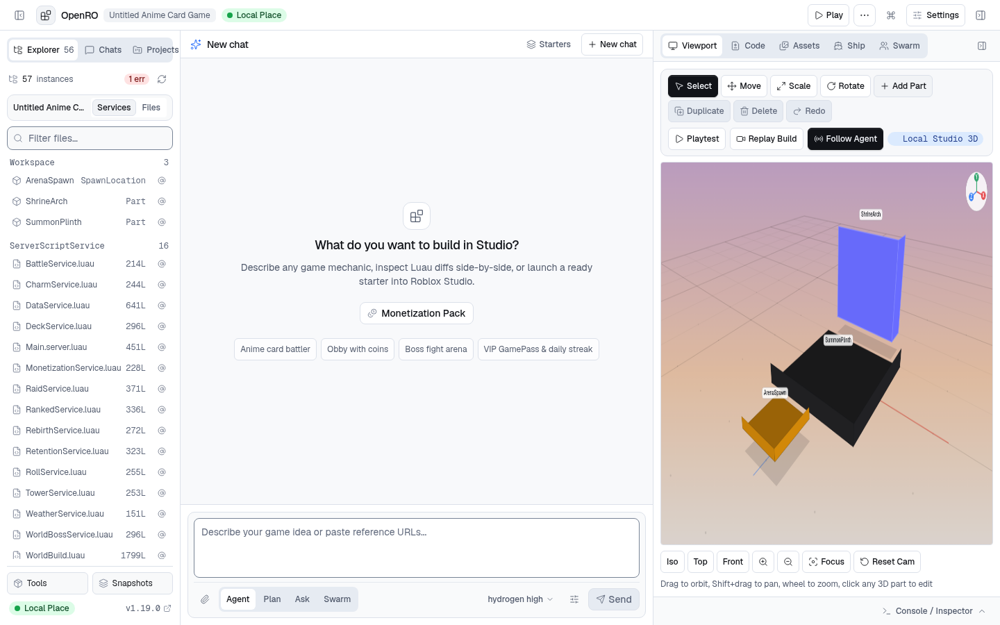
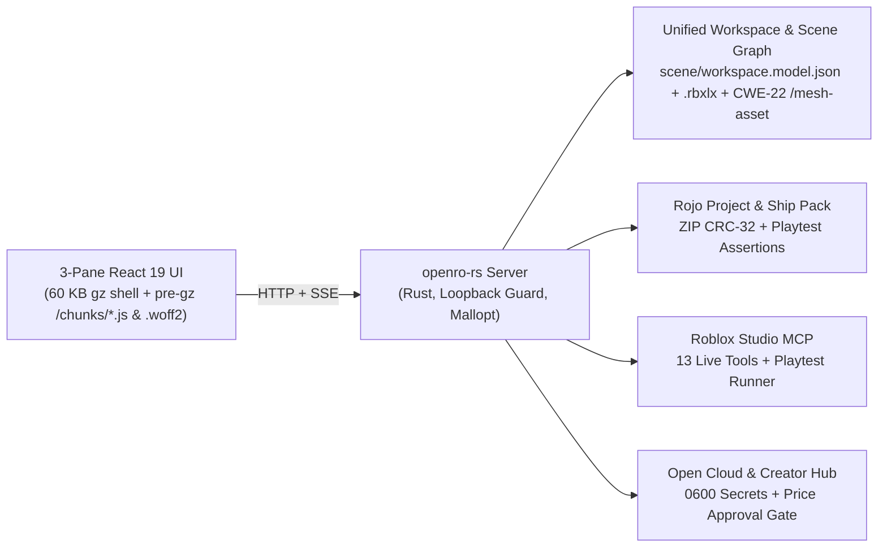

# OpenRO (`v1.19.0`)

[](https://github.com/cayleb-james2008/open-ro/releases/latest)
[](https://github.com/cayleb-james2008/open-ro/actions)
[](LICENSE)
[](#architecture)

OpenRO is a single-binary Roblox Studio IDE written in Rust with a React 19 interface. It builds, checks, monetizes, and publishes Roblox games from Rojo project folders or an embedded Local Place engine, with an offline browser demo (`web-dist/index.html`) that runs the same workflows locally with no external network requests.

<p align="center">
  <picture>
    <source media="(prefers-color-scheme: dark)" srcset="docs/screenshots/hero-dark.png" />
    
  </picture>
</p>

## What it does

- The three-pane workspace puts the Place explorer on the left, the Agent/Plan/Ask thread in the middle, and tabbed panels (`Viewport`, `Code`, `Assets`, `Ship`, `Swarm`) on the right. Opening a Rojo project populates Explorer (`Services` and `Files`), `Code` (saving directly to `.luau` files on disk and jumping straight to reported line numbers), Lighting controls, and the 3D Viewport from `scene/workspace.model.json` via `/api/projects/:id/{workspace,scene/mutate,mesh-asset}` while `projects::builtin_rbxlx` natively serializes `CFrame`, `Enum`, `Content`, `Color3uint8`, and `Lighting` properties.
- The economy balance and progression simulator parses Luau earn, price, rebirth, and GamePass constants to project a deterministic 60-minute player progression curve, flagging paywall dead-ends, runaway inflation, or under-2-minute exhaustion with a 1-click balance suggestion preview and safe tuning apply.
- The monetization and retention safety audit checks Luau scripts for missing `MarketplaceService.ProcessReceipt` idempotency (`PurchaseId` ledger and `PurchaseGranted` return), missing `DataStore` `BindToClose` shutdown flushes, unguarded `PromptGamePassPurchase` or `UserOwnsGamePassAsync` calls without `pcall`, and missing first-60s onboarding or daily streak hooks, with one-click jump and safe snippet repair.
- Before exporting or publishing, the preflight Luau and asset readiness guard checks for orphan asset refs (`rbxassetid://0`, local file paths, or missing `AssetIds` keys), broken `RemoteEvent` and `require()` bindings, unsafe `loadstring`, `getfenv`, `setfenv`, or numeric `require()` calls, and empty spawn or shop hooks, with one-click Jump to Issue and Apply Safe Autofix actions.
- Before publishing, the Rojo live-sync conflict resolver compares local `.luau` files on disk against your synced Place baseline, shows line diffs, and lets you accept local changes, restore the Place version, or save a backup snapshot in one click.
- The preflight hook-integrity check catches dropped Robux GamePass or DevProduct IDs, `ProcessReceipt` handlers, `Workspace.SpawnLocation`, and `--!strict` headers against your last verified snapshot, restoring missing hooks without overwriting new feature scripts.
- Playable snapshots track script diffs and assertion deltas between checkpoints so you can roll back to a verified build after taking an automatic safety checkpoint.
- The dependency audit and monetization tools inspect `require()` edges, remove unused ModuleScripts or orphan remotes, run deterministic economy funnel projections (`ARPDAU`, `D1`/`D7` retention, GamePass conversion), and keep Robux pricing gated until an owner approves it (`priceApproved: false`).
- Deterministic playtest suites verify Luau syntax, runtime logs, core loop checks, and economy wiring, with one-click fixes that rebuild `.rbxl` and verify Ship Pack `.zip` archives.

## Feature gallery

<table>
  <tr>
    <td width="50%" align="center">
      <strong>Ship readiness autopilot and pre-publish gate</strong>
      <br /><br />
      <picture>
        <source media="(prefers-color-scheme: dark)" srcset="docs/screenshots/ship-readiness-dark.png" />
        
      </picture>
    </td>
    <td width="50%" align="center">
      <strong>Monetization tier and 48h comeback retention designer</strong>
      <br /><br />
      <picture>
        <source media="(prefers-color-scheme: dark)" srcset="docs/screenshots/monetization-dark.png" />
        
      </picture>
    </td>
  </tr>
  <tr>
    <td colspan="2" align="center">
      <strong>Unified Rojo workspace, declarative 3D scene graph, and lighting preview (<code>v1.19.0</code>)</strong>
      <br /><br />
      <picture>
        <source media="(prefers-color-scheme: dark)" srcset="docs/screenshots/unified-workspace-dark.png" />
        
      </picture>
    </td>
  </tr>
</table>

## Architecture


```mermaid
flowchart LR
  UI["3-Pane React 19 UI<br/>(60 KB gz shell + pre-gz /chunks/*.js & .woff2)"] -->|HTTP + SSE| SRV["openro-rs Server<br/>(Rust, Loopback Guard, Mallopt)"]
  SRV --> LP["Unified Workspace &amp; Scene Graph<br/>scene/workspace.model.json + .rbxlx + CWE-22 /mesh-asset"]
  SRV --> PJ["Rojo Project &amp; Ship Pack<br/>ZIP CRC-32 + Playtest Assertions"]
  SRV --> MCP["Roblox Studio MCP<br/>13 Live Tools + Playtest Runner"]
  SRV --> OC["Open Cloud &amp; Creator Hub<br/>0600 Secrets + Price Approval Gate"]
```

## Verified benchmarks (`v1.19.0` vs `v1.2.0`)

| Metric | `v1.2.0` baseline | `v1.19.0` verified (`#154` pinned) | Delta |
| --- | --- | --- | --- |
| Release binary size | `19.00 MB` | **`9.17 MiB`** (`9,614,168 B`) | **`-51.7%`** |
| Initial `/` payload | `~1,368 KB` raw / `~459 KB` gz | **`253.1 KB`** raw (`259,196 B`) / **`60.1 KB`** gz (`61,550 B`) | **`-86.6%` wire** |
| Cold boot (`#154` pinned) | `1,470 ms` | **`31.62 ms`** | **`-97.8%`** |
| Peak RSS (`VmHWM`) | `115.20 MB` | **`12.75 MB`** (`13,052 KB`, `scale-audit` + 10 SSE) | **`-88.9%`** |
| Concurrent HTTP (`16w`) | `875 req/s` (`141.7 ms` p95) | **`4,778.5 req/s`** Python cold (`3.27 ms` p50, `4.46 ms` p95, `0` errs) | **`5.46x` (`-96.9%` p95)** |
| Security and UI gates | `43/43` fuzz | **`43/43` fuzz, `10/10` SSE, `0` sloplint fails/warns, `322/322` Rust tests (`6/6` `v119_unified_workspace`), `gate 56/56`, `replay 9/9`** | Pass |

## Quick start

```sh
# 1. Build the embedded single-file frontend and Rust release binary
npm --prefix frontend run build
touch src/lib.rs src/server.rs && cargo build --release --locked

# 2. Launch OpenRO (opens chromeless Studio window at http://127.0.0.1:8077; use --no-open for headless)
./target/release/openro-rs --no-open --port 8077

# 3. Verify Rust tests, Windows cross-check, and UI gates
cargo test -- --test-threads=1
cargo xwin check --target x86_64-pc-windows-msvc
npm --prefix frontend run check:ui -- --lints --skip-build
```

## Platform notes

OpenRO builds for Linux (`x86_64`, `aarch64`, `Xvfb`/Vinegar Studio embed), Windows (`x86_64-pc-windows-msvc`), and macOS (`aarch64-apple-darwin`). API references live in [Projects, Sync & Playtest](docs/API-V011.md), [Multi-Agent Teamwork](docs/API-V011-teamwork.md), [Creator Hub & Open Cloud](docs/API-V011-creator-hub.md), [Assets & Mesh](docs/API-V011-assets.md), [Study Ledger](docs/API-V011-study.md), and [Tool Adapters](docs/API-V011-adapters.md).
